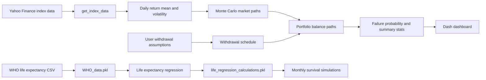
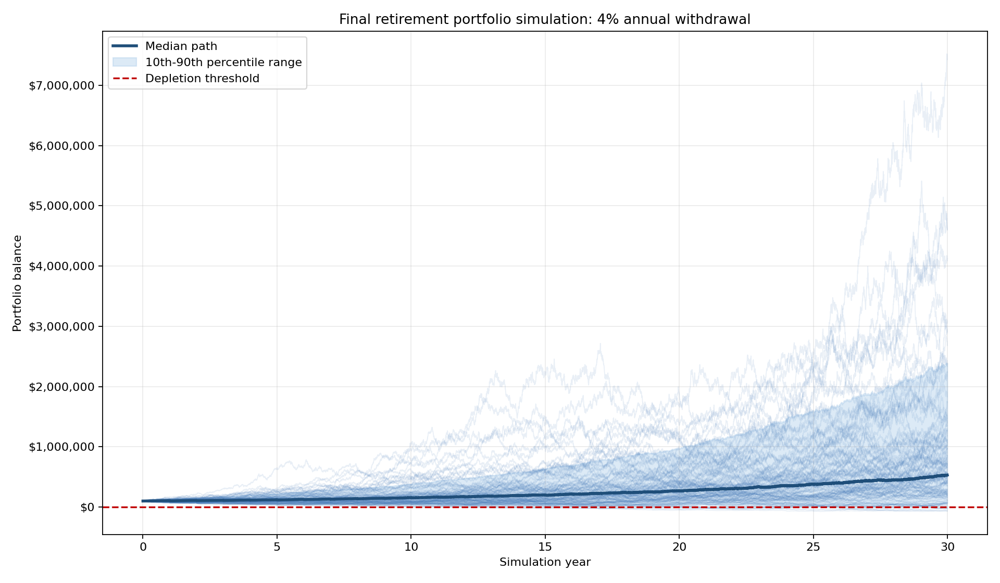
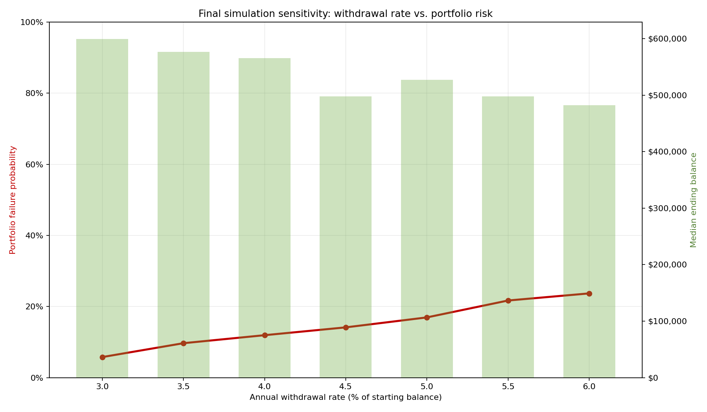

# Retirement Portfolio Payout Simulation

A Python portfolio project that explores a practical retirement question:

> Given an initial portfolio, a withdrawal rate, historical market volatility,
> and a simulated investment horizon, how often does the portfolio survive?

The repository combines a small simulation core, a Dash dashboard, and a WHO
life expectancy data pipeline. It is intentionally transparent: every assumption is visible, testable,
and documented for clear stakeholder conversations.

## What this project demonstrates

- Monte Carlo simulation of portfolio paths using historical index log returns.
- Fixed withdrawal modeling with yearly or monthly withdrawal schedules.
- Portfolio ruin metrics such as failure probability and average depletion year.
- A Dash dashboard for interactively exploring withdrawal assumptions.
- A WHO-based longevity module that can regenerate country/sex regression inputs.
- Unit tests for core math and data-loading behavior without relying on network calls.

## Architecture



For a deeper component view, see [docs/ARCHITECTURE.md](docs/ARCHITECTURE.md).

## Quick start

```bash
python -m venv .venv
source .venv/bin/activate
pip install -r requirements.txt
pytest
python dash_interface.py
```

Then open the local Dash URL printed in the terminal.

## Running the simulation modules directly

```bash
python stock_movements.py
```

The script downloads historical index data, simulates withdrawal paths, and
plots the simulated paths. The dashboard is the recommended demo entry point
because it provides reproducible controls and a summary table.

## Regenerating longevity data

The WHO data files are generated artifacts and are ignored by git. To rebuild
them locally:

```bash
python - <<'PY'
import life_expectancy as lf

lf.get_WHO_data()
lf.gen_life_reg_file(lf.DEFAULT_WHO_DATA_FILE)
PY
```

This creates:

- `WHO_data.pkl`
- `life_regression_calculations.pkl`

The longevity module can then run:

```python
import life_expectancy as lf

survival_paths = lf.survival_sim(
    sim_years=30,
    country="United States of America",
    age=62,
    sex="Male",
    sim_n=1000,
)
```

## Model assumptions and limitations

- A year is modeled as 252 trading days.
- Market returns are sampled from a normal distribution estimated from historical
  daily log returns.
- Withdrawals are fixed percentages of the initial balance.
- The default dashboard intentionally uses a fixed random seed so results are
  reproducible during a demo.
- Taxes, fees, inflation, asset allocation drift, fat-tail risk, and changing
  volatility regimes are not modeled yet.
- This is an educational simulation, not financial advice.

## Repository layout

```text
.
├── dash_interface.py       # Interactive Plotly Dash app
├── life_expectancy.py      # WHO data ingestion and survival simulation helpers
├── stock_movements.py      # Portfolio path and withdrawal simulation helpers
├── docs/
│   └── ARCHITECTURE.md     # Architecture notes and diagrams
├── tests/                  # Pytest tests for core behavior
└── *.ipynb                 # Exploratory notebooks and end-to-end story drafts
```

## Generated simulation artifacts

The repository includes reproducible final simulation images generated with:

```bash
python3 scripts/generate_final_simulation_artifacts.py
```





Additional business-value scenario analysis:

```bash
python3 scripts/generate_business_value_insights.py
```

- [Business value slides](docs/business_value_slides.md)
- [Scenario metrics CSV](docs/assets/business_value_scenario_insights.csv)
- [Failure sensitivity chart](docs/assets/business_value_failure_sensitivity.png)
- [Demographic risk chart](docs/assets/business_value_demographic_risk.png)
- [Business value matrix](docs/assets/business_value_matrix.png)

The scenario analysis compares withdrawal rates, market regimes, and longevity-adjusted planning horizons for men and women in the United States and Switzerland. It explicitly shows why male and female retirement strategies should differ: each segment includes a median/expected death age plus a longer portfolio-planning age, women typically need portfolios to last longer, and under-planning that horizon can increase senior-poverty risk.

## Future improvements

- Add inflation-adjusted withdrawals.
- Add asset allocation and rebalancing assumptions.
- Integrate longevity-adjusted success metrics directly into the dashboard.
- Add screenshots or a short demo GIF after deploying the Dash app.