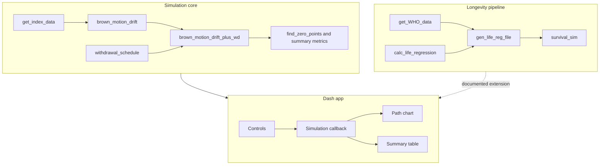
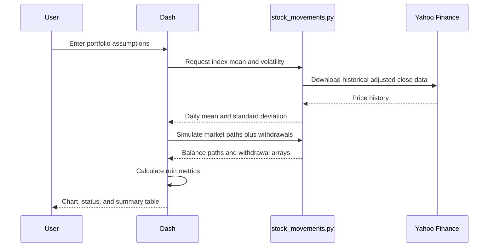

# Architecture

This project is split into three small, interview-friendly layers:

1. **Simulation core**: deterministic and testable portfolio math in
   `stock_movements.py`.
2. **Longevity data pipeline**: WHO ingestion, regression, and monthly survival
   simulation in `life_expectancy.py`.
3. **Presentation layer**: an interactive Plotly Dash dashboard in
   `dash_interface.py`.

## Component diagram



## Data flow



If Yahoo Finance is unavailable during a live demo, the dashboard uses documented
fallback assumptions for the selected index so the app can still be presented.

## Generated data

WHO source data and regression pickles are generated locally:


The generated `.pkl` files are ignored by git because they can be rebuilt from
the public WHO endpoint.

## Testing strategy

- Tests avoid network calls.
- Random simulations accept seeded random generators for reproducibility.
- Portfolio tests cover shape, withdrawal schedule behavior, depletion
  detection, and summary metric calculations.
- Longevity tests cover probability bounds, regression-file lookup, and survival
  simulation output shape.

Run all tests with:

```bash
pytest
```
