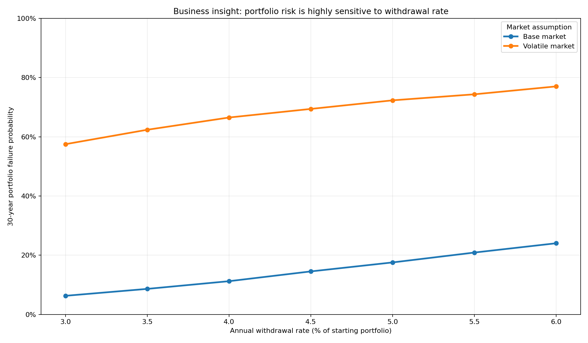
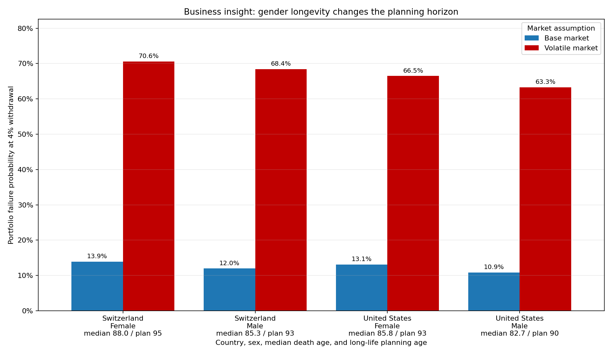
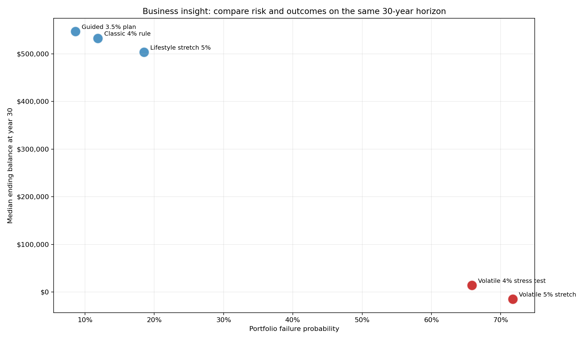

# Retirement Portfolio Simulator
## Turning financial uncertainty into explainable planning conversations

**Business problem:** retirees and advisors need a clear way to compare spending goals, market risk, and longevity assumptions before committing to a plan--especially because women often need assets to last longer and face elevated senior-poverty risk.

**Solution:** a Python + Dash simulator that converts customer assumptions into repeatable scenarios, visual risk metrics, and stakeholder-ready recommendations.

**Why it matters commercially:** the same model can support discovery, suitability conversations, stress testing, and executive-level value storytelling without relying on a black-box answer. It also shows why one-size-fits-all retirement guidance can under-serve women.

---

# Insight 1: withdrawal choices create visible risk trade-offs

**What the visualization shows:** each line is a market assumption, each point is a withdrawal rate, and the y-axis is the share of simulated portfolios that ran out of money within 30 years. Lower points are safer; steeper lines mean customers are more sensitive to spending changes.

- In the base market sweep, moving from a **3.0%** to **6.0%** withdrawal rate changed simulated failure risk from **6.3%** to **24.0%**.
- A guided **3.5%** plan produced **91.4%** survival vs. **88.1%** for the classic **4%** benchmark.
- Business value: the tool turns an abstract percentage into a transparent trade-off that advisors and clients can discuss together.

---

# Insight 2: gender and country change the recommendation conversation

**What the visualization shows:** each group represents a country/sex segment. The label shows both the median/expected death age and the long-life planning age used for the simulation. Women are tested over longer horizons because outliving a median plan is a key driver of senior poverty. The two bars compare the same 4% withdrawal under base and volatile market assumptions.

- At 4% in the base market, the lowest-risk segment was **United States Male** at **10.9%** simulated failure risk over **28 years**.
- The highest-risk base-market segment was **Switzerland Female** at **13.9%** over **33 years**.
- Strategy implication: with a **12% failure-risk budget**, the tested US male segment supports **4.0%**, while the US female segment shifts to **3.5%** and Swiss female segment shifts to **3.5%**.
- Business value: the solution can personalize guidance by market, country, sex, spending level, and planning horizon instead of presenting one generic rule. This makes the gender gap in longevity visible before it becomes a poverty-risk problem.

---

# Insight 3: the demo connects technical modeling to business outcomes

**What the visualization shows:** each dot is a 30-year planning scenario, so the ending balances are comparable on the same horizon. Moving right means higher failure risk; moving up means a higher median ending balance at year 30. The 40-year early-retirement case is kept in the CSV but intentionally excluded here because ending balances across different time horizons can be misleading.

- A **4% volatile-market stress test** showed **65.9%** failure risk, compared with **11.9%** for the base-market 4% benchmark.
- A **5% lifestyle stretch** raised failure risk to **18.5%** while producing a median ending balance of **$503,306**.
- Business value: this is a consultative workflow--capture assumptions, configure scenarios, explain risk, and align stakeholders around the next best action.
