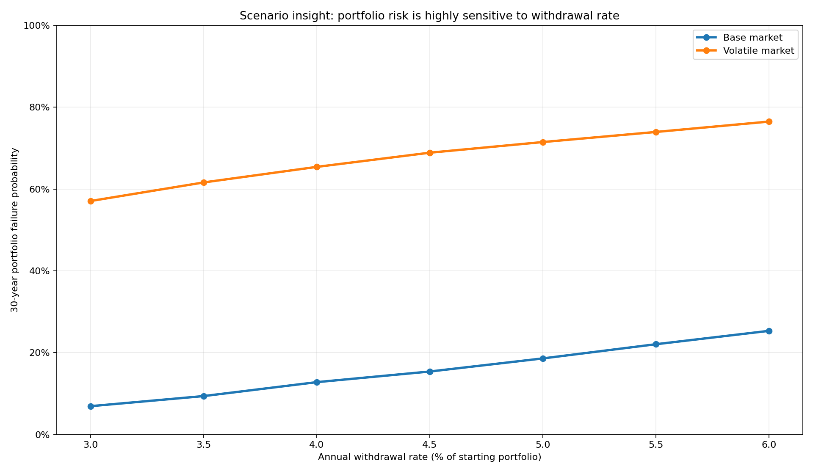
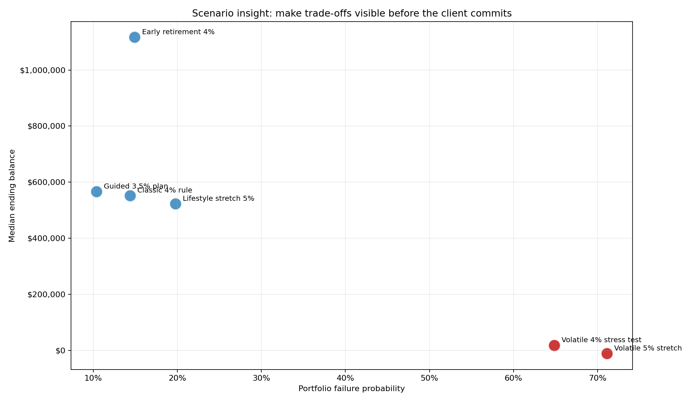

# Retirement Portfolio Simulator
## Turning financial uncertainty into explainable decisions

**Business problem:** retirees and advisors need to understand how spending choices, market risk, and planning horizon affect portfolio sustainability.

**Solution:** an interactive Python + Dash simulator that converts assumptions into repeatable scenarios, visual risk metrics, and stakeholder-ready recommendations.

**Solution-engineering angle:** discovery questions become configurable inputs; outputs become a clear business conversation rather than a black-box model.

---

# Insight 1: small input changes create large business trade-offs

- In the base market sweep, moving from a **3.0%** to **6.0%** withdrawal rate changed simulated failure risk from **6.9%** to **25.3%**.
- A guided **3.5%** plan produced **89.6%** survival vs. **85.6%** for the classic **4%** benchmark.
- Business value: helps advisors frame suitability, set expectations, and show clients why guardrails matter.

---

# Insight 2: the same product demo supports discovery, stress testing, and executive value

- A **4% volatile-market stress test** showed **64.9%** failure risk, compared with **14.4%** for the base-market 4% benchmark.
- A **5% lifestyle stretch** increased failure risk to **19.8%** while changing the median ending-balance story to **$522,609**.
- Why this fits a Solution Engineer role: I can connect technical implementation, customer discovery, risk storytelling, and measurable business outcomes in one demo.
